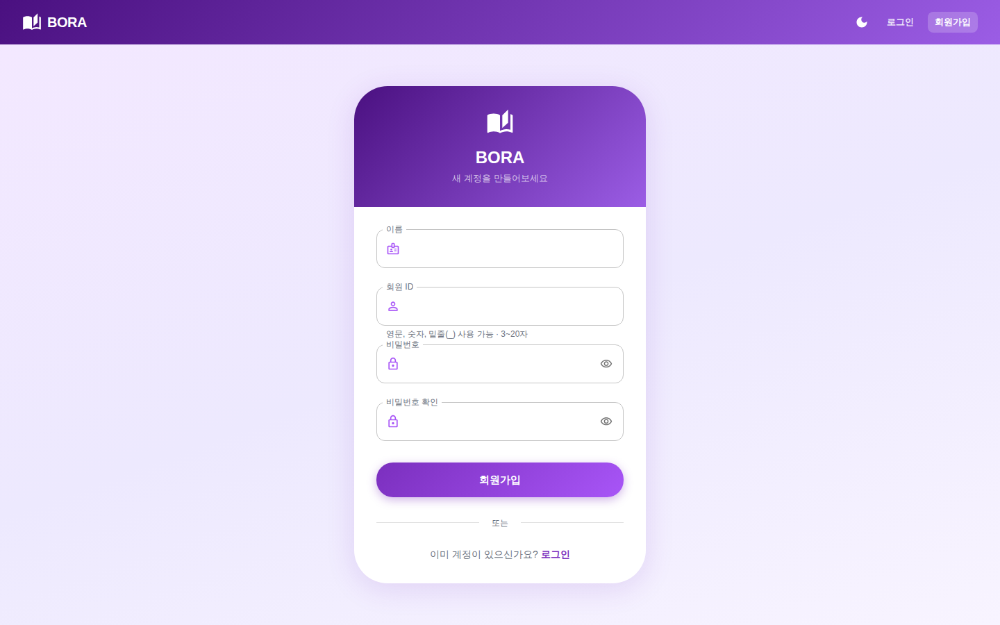
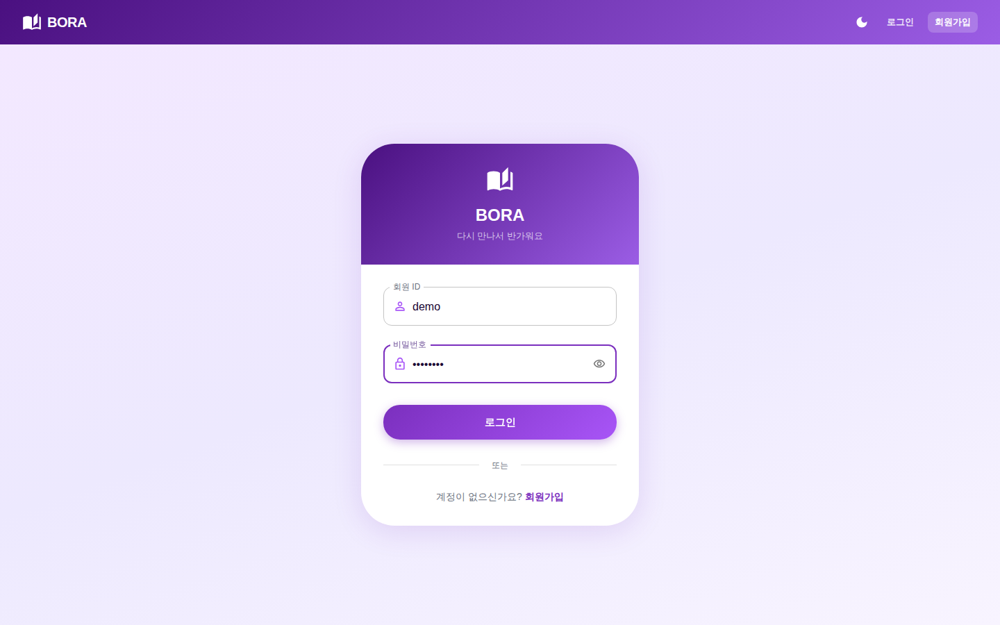
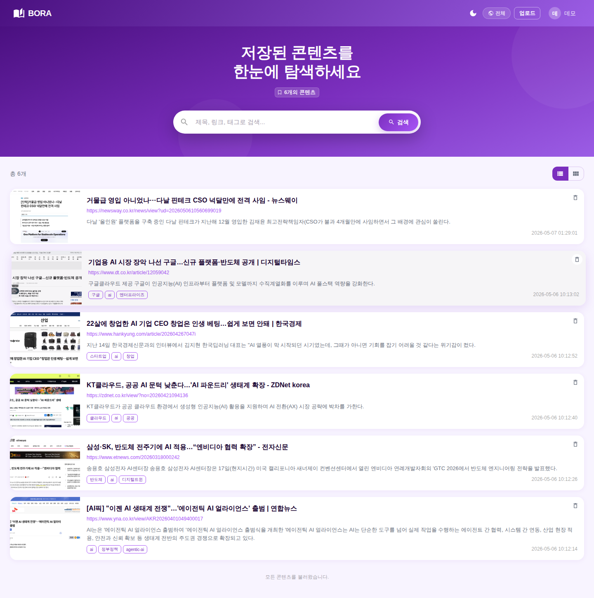
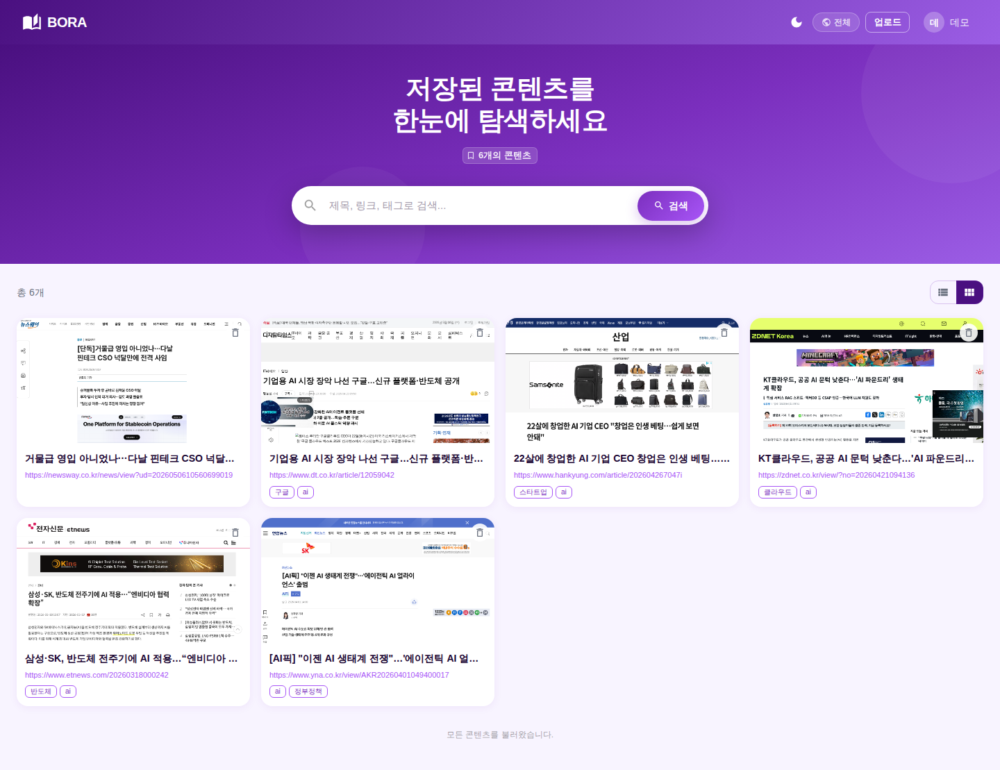
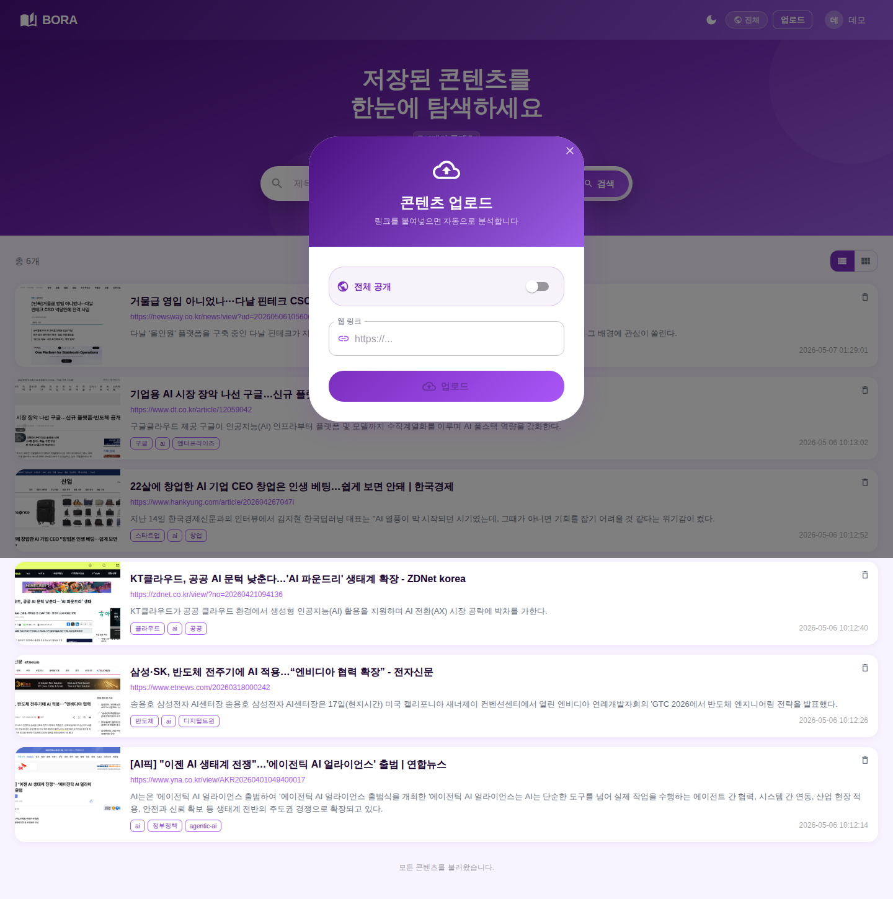
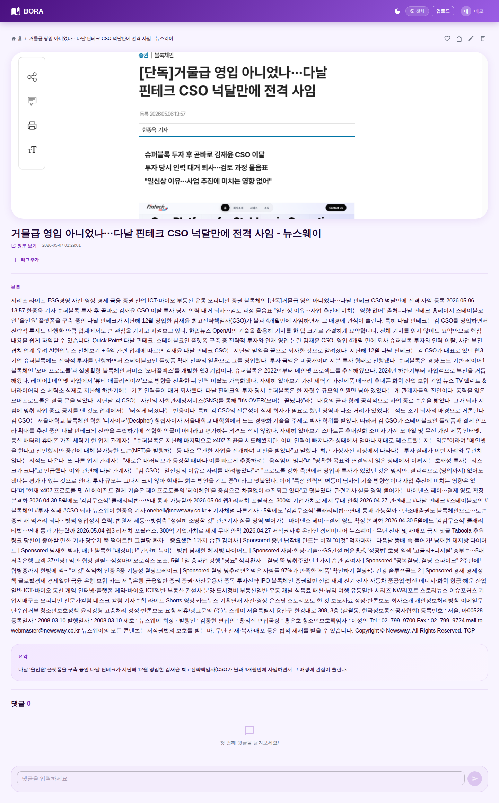
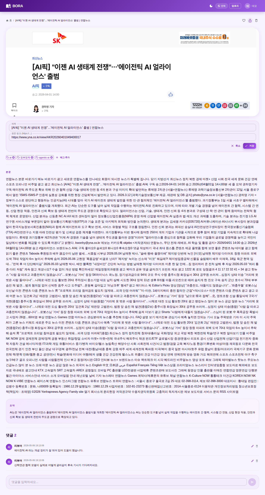
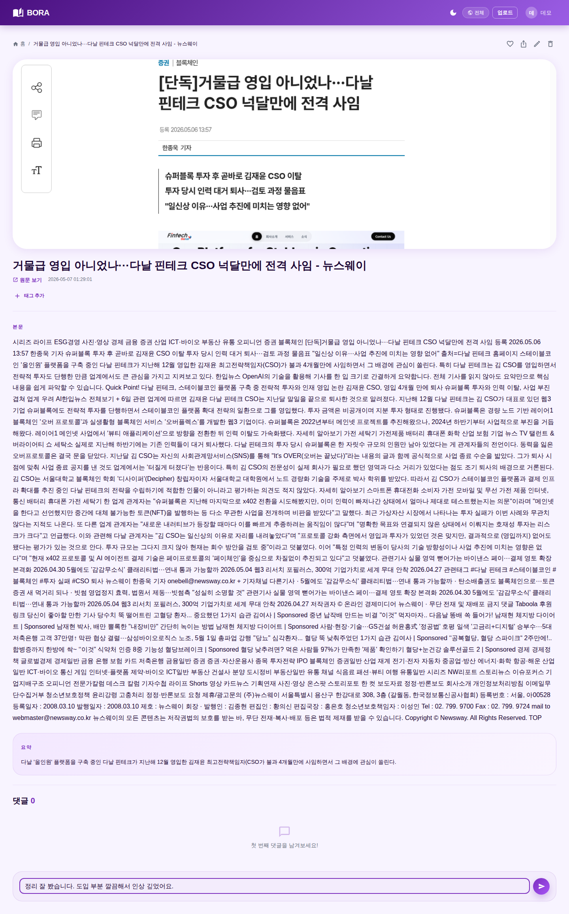
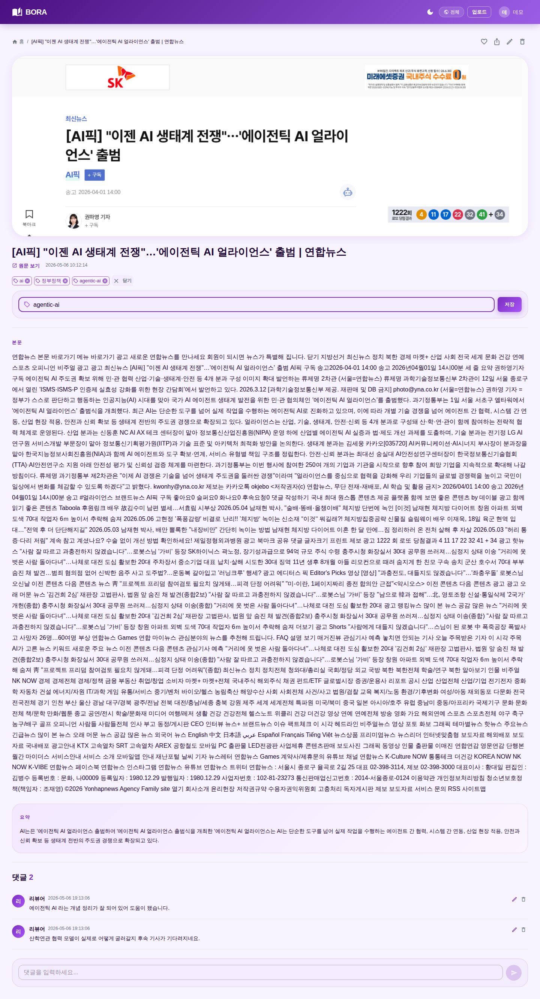
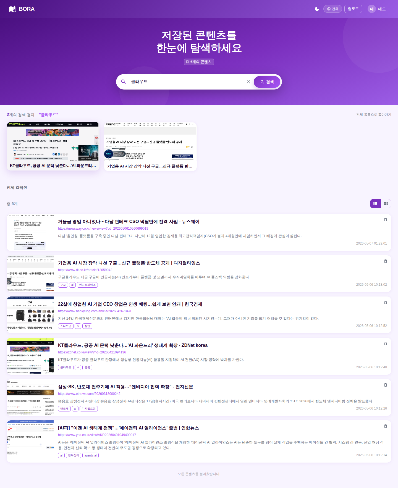

# BORA — 수집한 웹 링크 분석·정리 서비스

개인이 수집한 웹 링크와 PDF 자료를 키워드와 요약 정보로 정리해 다시 빠르게 찾아볼 수 있는 서비스.

자세한 프로젝트 설명과 전체 스크린샷은 [`docs/PORTFOLIO.md`](docs/PORTFOLIO.md) 참고.

## 스크린샷

### 1. 회원가입


| 화면 | 회원가입 폼 (이름 · 회원 ID · 비밀번호 입력) |
|---|---|
| 기능 | 입력값 길이·형식 검증 → 회원 ID 중복 검사 → 비밀번호는 일방향 해시(bcrypt) 처리 후 저장. 가입 직후 로그인 화면으로 자동 이동 |
### 2. 로그인


| 화면 | 로그인 폼 |
|---|---|
| 기능 | 회원 ID·비밀번호 검증 후 세션 토큰 신규 발급. 세션은 **7일** 후 만료. 한 계정의 동시 세션이 5개를 넘으면 가장 오래된 세션 자동 정리. 같은 계정의 로그인·회원가입 시도는 1분에 10회로 제한해 무차별 시도 차단 |
### 3. 메인 — 리스트 뷰


| 화면 | 가로 리스트 (썸네일 · 제목 · 요약 · 태그 · 등록일시) |
|---|---|
| 기능 | 검색창 입력이 멈춘 뒤 약 0.35초 후에야 서버 호출(불필요한 호출 절감). 목록 끝 카드가 화면에 들어오면 마지막 글 ID 기준으로 다음 묶음 호출 후 새로고침 없이 이어 붙임. 본인이 쓴 글에만 카드 우측 휴지통 아이콘 노출 → 삭제 시 목록과 상세 모두 즉시 갱신 |
### 4. 메인 — 그리드 뷰


| 화면 | 4열 카드 그리드로 표시 |
|---|---|
| 기능 | 우측 상단 토글로 리스트/그리드 즉시 전환(상태는 전역 컨텍스트로 공유). 마지막 카드 노출 감지 시 다음 묶음 자동 로딩. 카드 호버 시 떠오르는 그림자로 상호작용 가시화 |
### 5. 업로드 모달


| 화면 | 외부 웹 링크 입력 모달 |
|---|---|
| 기능 | 등록 클릭 시 백엔드가 크롤러로 URL 전달 → 크롤러가 실제 브라우저(Selenium)로 페이지 렌더 → 본문 텍스트 추출 → 한국어 요약 모델(KoBART)로 요약 생성 → 페이지 전체 캡쳐 후 무작위 ID 파일명으로 저장. 작성자 정보는 크롤러가 회원 DB 의 가장 최근 사용자에서 자동 매핑 |
### 6. 상세 페이지


| 화면 | 선택한 글의 상세 (제목 · 원문 링크 · 태그 · 요약 · 본문 · 댓글) |
|---|---|
| 기능 | 좋아요 토글 시 사용자 ID 를 글의 좋아요 배열에 추가/제거하고 카운트 즉시 갱신. 공유 버튼 클릭 시 현재 URL 을 클립보드로 복사하고 안내 토스트 노출. 본인 글이면 우측 상단에 수정·삭제 아이콘 동시 노출 |
### 7. 상세 — 본인 글 편집 모드


| 화면 | 제목 · 링크 입력 폼이 본문 자리에 펼쳐진 상태 |
|---|---|
| 기능 | 제목·링크만 부분 수정하는 별도 API 호출(다른 필드는 건드리지 않음). 응답 받은 최신 글 객체를 그 자리에서 화면 상태에 갈아끼워 새로고침 없이 반영. 작성자 본인이 아니면 편집 진입 자체 차단 |
### 8. 상세 — 댓글 영역


| 화면 | 본문 하단 댓글 목록과 입력칸 |
|---|---|
| 기능 | 댓글 등록·수정·삭제 모두 동일 화면에서 처리. 수정 시 ID 기준으로 기존 댓글 항목을 자리에서 갈아끼워 "익명 댓글이 새로 생기는" 현상 방지. 삭제 즉시 목록과 댓글 수가 동시에 줄어듦 |
### 9. 상세 — 댓글 입력 중


| 화면 | 입력칸이 채워진 직전 상태와 활성화된 등록 버튼 |
|---|---|
| 기능 | 입력값이 비어 있으면 등록 버튼 비활성화. 등록 시 서버가 작성자 정보까지 채워 돌려준 댓글을 받아 그대로 목록에 끼워 넣음 → 익명 표시·재로딩 없이 바로 가시화 |
### 10. 상세 — 태그 추가 패널


| 화면 | 태그 추가 입력칸이 열린 상태 |
|---|---|
| 기능 | 태그 추가 시 부분 수정 API 호출로 태그 배열만 갱신. 응답으로 받은 최신 글을 메인 컨텍스트에서 ID 기준으로 갈아끼워 메인 카드와 상세 양쪽이 동시에 변경. 같은 태그 중복 추가 차단, 칩 우측 X 클릭으로 즉시 삭제 |
### 11. 검색 결과


| 화면 | 검색창에 키워드 입력 후 필터링된 결과 |
|---|---|
| 기능 | 입력이 멈춘 뒤 약 0.35초 후 호출(디바운스). 1차로 MongoDB 텍스트 인덱스(제목 10 / 태그 5 / 요약 3 / 본문 1 가중치)로 정렬해 가져옴. 결과가 0건이면 정규식 보조 매칭으로 한 번 더 시도 → 한국어 토큰 한계 보완 |
## 보안·입력 검증 (bora-web API)

- **세션:** `authentication` 미들웨어에서 세션 생성 시각 기준 **7일** 초과 시 제거 후 401
- **헤더:** `helmet` 기본 보안 헤더(CSP는 순수 JSON API에 맞게 비활성화, 정적 `/uploads`는 CORS 정책에 맞게 조정)
- **NoSQL 인젝션:** `express-mongo-sanitize`로 `req.body` / `query` / `params` 정리
- **원문 링크:** 백엔드에서 **http/https URL만** 저장·수정 허용; 프론트 상세는 안전한 `href`만 렌더
- **본문 크기:** JSON 파싱 상한 1MB
- **댓글·검색·태그:** 길이 상한(댓글 8000자, 검색어 처리 200자, 태그 64자)

RDB/SQL을 쓰지 않으므로 **SQL 인젝션**은 해당 없음. MongoDB 쿼리는 Mongoose·ObjectId 검사·검색 정규식 이스케이프로 방어를 보강함.

## 폴더 구조
- `bora-web/` — 메인 웹앱 (React 프론트 + Node.js/Express 백엔드)
  - `frontend/` — CRA 기반 React 앱 (포트 4200)
  - `backend/` — Express + Mongoose 서버 (포트 5100)
- `bora-crawler/` — 크롤링·요약 서비스 (Flask + Selenium + KoBART)
  - `flask_docker/` — Flask 앱
  - `nginx/`, `proxy/` — 도커용 Nginx 설정 (외부 진입 포트 9000)
- `docker-compose.yml` — 루트 통합 compose (참고용)
- `bora-crawler/docker-compose.yml` — 크롤러 단독 실행용 compose

---

## 실행 방법

### 사전 요구
- Node.js 20 이상 + npm
- Docker / Docker Compose
- MongoDB Atlas 계정 (또는 로컬 MongoDB)

### 1. 환경 변수 설정

#### `bora-web/backend/.env`
```env
MONGO_URI=mongodb+srv://<USER>:<PASSWORD>@<CLUSTER>/bora?retryWrites=true&w=majority
PORT=5100
```

#### `bora-web/frontend/.env`
```env
REACT_APP_API_URL=http://localhost:9000
PORT=4200
```
> `REACT_APP_API_URL` 은 크롤러가 캡처한 썸네일·정적 자산을 가져오는 주소로, 크롤러 진입 포트(9000)를 가리킴. API 호출은 프론트의 `proxy` 설정으로 5100 포트(API 서버)에 연결됨.

### 2. 크롤러 (Flask + Selenium + 요약 모델) 실행

```bash
cd bora-crawler
docker compose up -d
```

- 외부 진입: `http://localhost:9000`
- 첫 실행 시 KoBART 모델을 내려받느라 시간이 걸릴 수 있음 (이후엔 도커 볼륨에 캐싱)

상태 확인 / 로그:
```bash
docker compose ps
docker compose logs -f flask
```

### 3. 백엔드 (API 서버) 실행

```bash
cd bora-web/backend
npm install
npm run dev
```

- `Express server listening on PORT 5100`
- 첫 실행 시 `MainContent indexes synced` 로그가 출력되면 검색용 텍스트 인덱스가 정상 생성된 것

### 4. 프론트 (React) 실행

```bash
cd bora-web/frontend
npm install --legacy-peer-deps
NODE_OPTIONS=--openssl-legacy-provider npm start
```

- `http://localhost:4200` 에서 접속
- `NODE_OPTIONS=--openssl-legacy-provider` 는 Node 17 이상 + react-scripts 4 호환을 위한 플래그

### 5. 종료

```bash
cd bora-crawler && docker compose down
```

백엔드 / 프론트는 각 터미널에서 `Ctrl+C` 로 종료.

---

## 포트 정리

| 포트 | 용도 |
|---|---|
| 4200 | React 프론트엔드 |
| 5100 | Node.js API |
| 8081 | 크롤러 내부 Nginx (Flask 정적 자산 서빙) |
| 9000 | 크롤러 외부 진입 (Reverse Proxy) |
| 24810 | Flask 앱 (Gunicorn, 컨테이너 내부) |

---